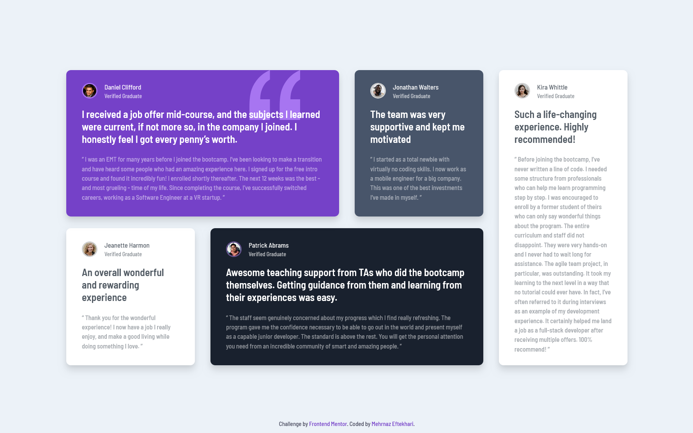

# Frontend Mentor - Testimonials grid section solution

This is a solution to the [Testimonials grid section challenge on Frontend Mentor](https://www.frontendmentor.io/challenges/testimonials-grid-section-Nnw6J7Un7). Frontend Mentor challenges help you improve your coding skills by building realistic projects.

## Table of Contents

- [Overview](#overview)
  - [The Challenge](#the-challenge)
  - [Screenshots](#screenshots)
  - [Links](#links)
- [My Process](#my-process)
  - [Built With](#built-with)
  - [What I Learned](#what-i-learned)
  - [Continued Development](#continued-development)
  - [Useful Resources](#useful-resources)
  - [Color Palette](#color-palette)
  - [Fonts](#fonts)
- [Author](#author)
- [Acknowledgments](#acknowledgments)

## Overview

### The Challenge

Users should be able to:

- View the optimal layout for the site depending on their device's screen size.

### Screenshots

### Links

- Solution URL: [View on GitHub](https://github.com/mehrnaz98/testimonials-grid-section)
- Live Site URL: [View on Netlify](https://rococo-sunflower-06b644.netlify.app/)

## My Process

### Built With

- Semantic HTML5 markup
- CSS Grid for layout
- CSS and Tailwind CSS for styling

### What I Learned

This project helped me improve my skills in working with grids and CSS layout techniques. I practiced building responsive grid layouts, handling different screen sizes, and adjusting the grid structure in media queries. Working with CSS Grid also helped me understand the flexibility of two-dimensional layouts for creating complex designs with ease.

### Continued Development

I aim to further develop my CSS Grid skills to design more intricate layouts and enhance my understanding of responsive web design. Additionally, I'll continue to explore styling components with various approaches to keep the design adaptable across different devices.

### Useful Resources

- [CSS Tricks - A Complete Guide to Grid](https://css-tricks.com/snippets/css/complete-guide-grid/) - This helped me understand the basics and advanced uses of CSS Grid.
- [MDN Web Docs on CSS Grid](https://developer.mozilla.org/en-US/docs/Web/CSS/CSS_Grid_Layout) - A great reference for quickly checking grid properties and functions.

### Color Palette

#### Primary

- Red: hsl(0, 78%, 62%)
- Cyan: hsl(180, 62%, 55%)
- Orange: hsl(34, 97%, 64%)
- Blue: hsl(212, 86%, 64%)

#### Neutral

- Very Dark Blue: hsl(234, 12%, 34%)
- Grayish Blue: hsl(229, 6%, 66%)
- Very Light Gray: hsl(0, 0%, 98%)

### Fonts

- Family: [Barlow Semi Condensed](https://fonts.google.com/specimen/Barlow+Semi+Condensed)
- Weights: 500, 600

## Author

- GitHub - [mehrnaz98](https://github.com/mehrnaz98/)
- Frontend Mentor - [mehrnaz98](https://www.frontendmentor.io/profile/mehrnaz98)

## Acknowledgments

A special thanks to the Frontend Mentor community for inspiration.
